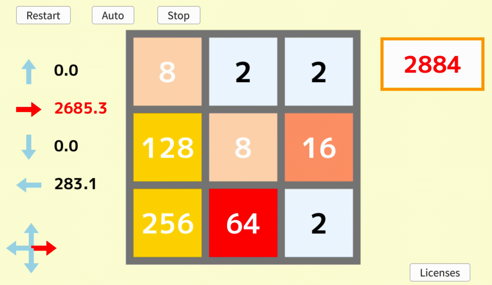

# Strongly Solving 2048 on 3 x 3 board

<p align="center">


</p>
Tnis GUI was created using OpenSiv3d (https://github.com/Siv3D/OpenSiv3D) but not released.

## overview
2048 is a popular single-player sliding block puzzle game on 4 x 4 board (https://github.com/gabrielecirulli/2048).<br>
We strongly solved 2048 on 3 x 3 board.<br>
The procedure consists of enumerating all possible states and calculating the values of these enumerated states.<br>

## build
```
~/solving_3x3_2048$ cmake -B ./buildtree
~/solving_3x3_2048$ cmake --build ./buildtree
```
## run enumeration
```
~/solving_3x3_2048$ ./buildtree/src/enumeration ./enumeration_result/
```
## run calculation
```
~/solving_3x3_2048$ ./buildtree/src/calculation ./enumeration_result/ ./calculation_result/
```
## result
|number of legal states|number of legal afterstates|number of terminal states|expected value of initial states|
|-:|-:|-:|-:|
|48,713,519|31,431,374|7,388,502|about 5,470| 

More details are avalilable from https://ipsj.ixsq.nii.ac.jp/ej/?action=repository_uri&item_id=221984 (Japanese).